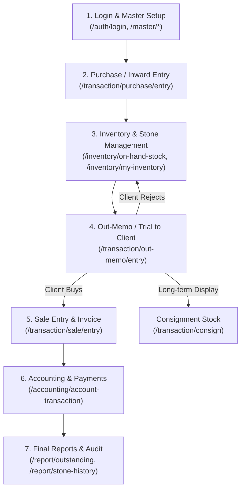

# 💎 Shree HK Company ERP - Complete Software Workflow & Stock Guide

Yeh document **Shree HK Diamond ERP Software** ka complete flow, terms aur stock lifecycle ko aasan bhasha me samjhata hai.

---

## 📌 Table of Contents
1. [Software Workflow (Start to End)](#1-software-workflow-start-to-end)
2. [Important Business Terms & Kyu Data Aata Hai](#2-important-business-terms--kyu-data-aata-hai)
3. [Stock Tracking: Hamare Paas Stock vs Client ko Diya Stock](#3-stock-tracking-hamare-paas-stock-vs-client-ko-diya-stock)
4. [Out-Memo Decision Actions (Return, Sale, Consign)](#4-out-memo-decision-actions-return-sale-consign)
5. [Complete Lifecycle Summary Table](#5-complete-lifecycle-summary-table)

---

## 1. Software Workflow (Start to End)



### Step-by-Step Pages:

1. **START: Login & Master Setup**
   * **Pages:** `Login` (`/auth/login`), `Master Details` (`/master/*`)
   * **Kaam:** User login karta hai. Company details, Labs (GIA/IGI), Categories, RapNet Price List aur Accounting Parties set hoti hain.

2. **STOCK ENTRY: Purchase / Inward**
   * **Pages:** `Purchase Entry` (`/transaction/purchase/entry`), `Inward Import` (`/transaction/inward/import`), `In-Memo Entry` (`/transaction/in-memo/entry`)
   * **Kaam:** Supplier se stone buy kiya jata hai. SKU/Barcode generate hota hai aur stock system me add hota hai.

3. **INVENTORY: Stock Management**
   * **Pages:** `On Hand Stock` (`/inventory/on-hand-stock`), `My Inventory` (`/inventory/my-inventory`), `Barcode` (`/inventory/barcode`), `Box / Parcel` (`/inventory/box`, `/inventory/parcel`)
   * **Kaam:** Tijori/Office me jo stock physically maujood hai uska live hisaab rehta hai.

4. **OUTWARD / OUT-MEMO: Client Trial**
   * **Pages:** `Out-Memo Entry` (`/transaction/out-memo/entry`), `Out Memo List` (`/transaction/out-memo`)
   * **Kaam:** Client ko dekhne/trial ke liye temporary stone issue kiya jata hai.

5. **SALES: Final Selling**
   * **Pages:** `Sale Entry` (`/transaction/sale/entry`), `Sale Stock` (`/transaction/sale`)
   * **Kaam:** Final invoice banta hai, stock permanent minus ho jata hai.

6. **ACCOUNTING: Payments**
   * **Pages:** `Transactions` (`/accounting/account-transaction`), `Advance` (`/accounting/advance`), `Expenses` (`/accounting/expanse`)
   * **Kaam:** Client se payment lena aur Supplier ko payment chukana.

7. **END: Reports & Settlement**
   * **Pages:** `Outstanding Report` (`/report/outstanding`), `Stone History` (`/report/stone-history`), `My Balance` (`/accounting/my-balance`)
   * **Kaam:** Baki payment ka hisaab, stone ki poori history aur profit/loss ka audit.

---

## 2. Important Business Terms & Kyu Data Aata Hai

### 1️⃣ Purchase (खरीदी)
* **Matlab:** Jab aap supplier/party se diamond **pakka khareed** lete hain.
* **Data kyu aata hai:** Naye stone ka Carat, Weight, Price aur Supplier party record hoti hai. Stock **My Inventory** me permanently add ho jata hai aur accounting me Supplier ka payment payable banta hai.

### 2️⃣ In-Memo (Approval par laaya gaya stone)
* **Matlab:** Supplier se stone **bina khareede sirf check karne ya client ko dikhane ke liye** laana.
* **Data kyu aata hai:** Taaki pata rahe yeh stone hamara nahi hai. Pasand aane par Purchase banega, warna wapas Return ho jayega.

### 3️⃣ Out-Memo (Client ko check karne ke liye diya gaya stone)
* **Matlab:** Client ko 2 se 5 din ke liye dekhne/check karne ke liye dena.
* **Data kyu aata hai:** Office se diamond bahar gaya hai par bika nahi hai. Track rehta hai ki stone kis client ke paas hai.

### 4️⃣ Sale (बिक्री / Final Bill)
* **Matlab:** Jab stone client ko **final bech diya** jata hai.
* **Data kyu aata hai:** Final invoice generate hoti hai, stock inventory se minus ho jata hai aur payment receivable banta hai.

### 5️⃣ GIA-Memo
* **Matlab:** Diamond ko **Lab Certification (GIA/IGI)** ke liye bhejna taaki track rahe ki stone abhi testing lab me hai.

### 6️⃣ Consign / Consignment
* **Matlab:** Stone ko **lambe samay (long-term)** ke liye showroom display, counter ya foreign agent ke paas rakhne ke liye dena.

---

## 3. Stock Tracking: Hamare Paas Stock vs Client ko Diya Stock

### 🏢 Hamare paas tijori me kitne stone hain?
* **Kaha dekhe:** `Inventory` ➔ **`On Hand Stock`** (`/inventory/on-hand-stock`)
* **Kya dikhega:** Jo diamonds physically aapke paas available hain (Total Pcs, Total Carats, SKU).

### 🤝 Client ko check karne ke liye kitne stone diye hain?
* **Kaha dekhe:** `Transaction` ➔ **`Out Memo`** (`/transaction/out-memo`)
* **Kya dikhega:** Kaunsa stone kis party ke paas gaya hai, kis date ko aur kis rate par.

---

## 4. Out-Memo Decision Actions (Return, Sale, Consign)

Out-Memo page par har stone ke liye 3 main actions hote hain:

```
                          ┌───────────────────────────┐
                          │    Out Memo me Stone Hai  │
                          └─────────────┬─────────────┘
                                        │
        ┌───────────────────────────────┼──────────────────────────────┐
        ▼                               ▼                              ▼
  1️⃣ [RETURN]                      2️⃣ [SALE]                      3️⃣ [CONSIGN]
(Pasand nahi aaya)            (Turant Khareed Liya)         (Lambe time display ke liye)
        │                               │                              │
Stone wapas aapke             Final Sale Invoice ban        Stone "Consignment Stock" 
"On-Hand Stock" me            jayega aur party ke           me chala jayega (Aapko pata 
add ho jayega.                khate me amount jud           rahega ki stone unke counter 
                              jayega.                       par lambe time se pada hai).
```

1. **Return:** Client ne stone pasand nahi kiya aur lauta diya ➔ Stone wapas `On Hand Stock` me aa jata hai.
2. **Memo To Sale:** Client ne diamond khareed liya ➔ Final Sale Bill ban jata hai aur stock se deduct hota hai.
3. **To Consign:** Client ne bola "Showroom counter par display ke liye rehne do" ➔ Yeh Consignment tracking me shift ho jata hai.

---

## 5. Complete Lifecycle Summary Table

| Action / Term | Kya Matlab Hai? | Page Route | Stock par Asar |
| :--- | :--- | :--- | :--- |
| **Purchase** | Pakka Stone Buy Kiya | `/transaction/purchase/entry` | Stock me **Add** (+) |
| **On Hand Stock** | Tijori me Available Stock | `/inventory/on-hand-stock` | Live Available Stock |
| **Out-Memo** | Client ko Trial par Diya | `/transaction/out-memo` | Stock se Temporary Out |
| **Return** | Client se Wapas Aaya | `/transaction/out-memo` [Return] | Stock me Wapas In (+) |
| **Memo To Sale** | Client ne Buy Kar Liya | `/transaction/out-memo` [Sale] | Stock se Permanent Out (-) |
| **To Consign** | Display / Counter pe Diya | `/transaction/out-memo` [Consign] | Consignment Stock Tracking |
| **Accounting** | Payment Liya / Diya | `/accounting/account-transaction` | Cash/Bank & Party Ledger Update |
| **Reports** | Outstanding & History | `/report/outstanding`, `/report/stone-history` | Final Settlement & Audit |
