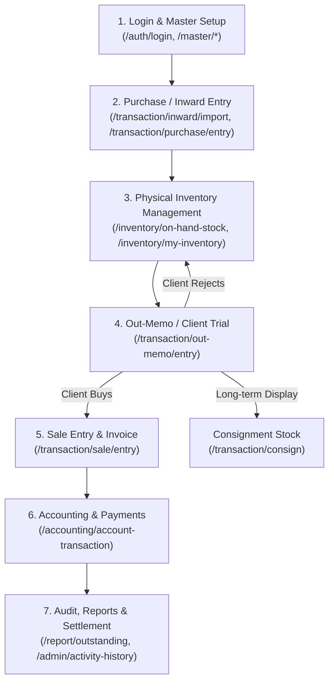
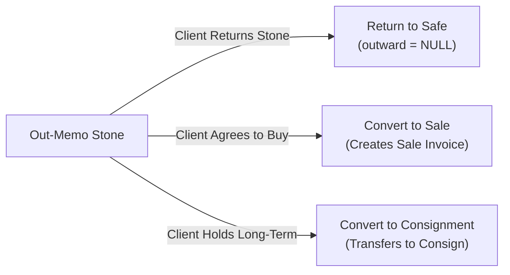

# 💎 ShreeHK Diamond ERP — Complete Master Workflow & Architecture Guide

> **Single Source of Truth:** Yeh document poore ShreeHK Diamond ERP software ka complete business workflow, stone lifecycle, database architecture, accounting structure aur development guidelines ko short & sweet format me cover karta hai.

---

## 📌 Table of Contents
1. [Tech Stack & System Architecture](#1-tech-stack--system-architecture)
2. [Software Workflow (Start to End)](#2-software-workflow-start-to-end)
3. [Diamond Stock & Stone Lifecycle](#3-diamond-stock--stone-lifecycle)
4. [Outward & Transaction Actions](#4-outward--transaction-actions)
5. [Accounting & Settlement Flow](#5-accounting--settlement-flow)
6. [Core Database Schema Reference](#6-core-database-schema-reference)
7. [Advance Features & Tools Reference](#7-advance-features--tools-reference)

---

## 1. Tech Stack & System Architecture

```
[ Frontend: React 19 + Vite 7 + Ant Design 6 + Zustand + React Query + SCSS Modules ]
                                  ↕ Axios Client (JWT + Tenant Header)
[ Backend: Node.js + Express (4-Layer: Route ➔ Validator ➔ Service ➔ Repository) ]
                                  ↕ Multi-Tenant Connection Pool
[ Database: MySQL (Multi-Tenant by Company & Year) ]
```

* **Frontend:** React 19, Vite, Ant Design v6, TanStack Query, Zustand, Axios, SCSS Modules
* **Backend:** Node.js, Express, MySQL connection pools, JWT Authentication, Multer, PDFKit, Groq / Gemini AI SDKs
* **Design Standards:** 4-Layer Architecture (`routes`, `validators`, `services`, `repositories`), Mandatory Tenant Isolation (`company = ?`), Reusable Base Components.

---

## 2. Software Workflow (Start to End)



### Module Breakdown:
1. **Master Setup (`/master/*`):** Company, Labs (GIA/IGI/HRD), Categories, RapNet live matrix, Parties and Accounts setup.
2. **Stock Inward (`/transaction/inward/*`):** Supplier se diamond buy karna, Excel import template upload, SKU barcode generation.
3. **Inventory Management (`/inventory/*`):** On-hand physical stock, Box/Parcel categorization, Smart Pair matching, Hold/Reservation.
4. **Out-Memo / Trial (`/transaction/out-memo`):** Client ko trial/inspection ke liye temporary diamond issue karna.
5. **Sales Invoice (`/transaction/sale`):** Final sale voucher create karna, stock inventory se deduct karna.
6. **Accounting & Payments (`/accounting/*`):** Ledger transactions, Advance payments, Expense tracking, Party outstanding balance.
7. **Reports & Audit (`/report/*`, `/admin/activity-history`):** Complete stone audit logs, Outstanding ledger reports, Stock verification audits.

---

## 3. Diamond Stock & Stone Lifecycle

```
[ INWARD — Stone ERP me aata hai ]
   Import / Purchase / In-Memo / In-Consignment
              ↓
   Creates: dai_inward (Header) + dai_product + dai_product_value (Line Items)
              ↓
   Status: On-Hand Inventory (visibility = 1, outward is NULL/empty)
              ↓
[ OUTWARD — Stone party ko jata hai ]
   Out-Memo / Out-Consignment / Sale / Export / GIA Lab
              ↓
   Updates: dai_outward (Voucher) + dai_product.outward = 'memo' / 'consign' / 'sale' / 'export' / 'lab'
```

### Key Stone State Fields (`dai_product`):
| Field | Value | Matlab |
|---|---|---|
| `visibility` | `1` / `0` | Active stock vs Deleted/Archived stock |
| `hold` | `1` / `0` | Client hold reservation (with auto-release expiry) |
| `outward` | `NULL` / `''` | **In Safe (Available on Hand)** |
| `outward` | `'memo'` | Out on Memo (Temporary client inspection) |
| `outward` | `'consign'` | Out on Consignment (Branch/dealer display) |
| `outward` | `'sale'` | Permanently Sold (Stock reduced) |
| `outward` | `'lab'` / `'export'` | Sent to Lab (GIA/IGI) or Export outward |
| `pair` | `SKU_NUMBER` | Paired with matching partner diamond |

---

## 4. Outward & Transaction Actions

Jab diamond **Out-Memo** par hota hai, to 3 main actions possible hote hain:



* **Return:** Stone wapas tijori/office inventory me add ho jata hai.
* **Convert to Sale:** Memo automatically close hoti hai, Sale invoice create hota hai, Party debit hoti hai.
* **Convert to Consignment:** Long-term dealer partnership me transfer ho jata hai.

---

## 5. Accounting & Settlement Flow

* **Transaction Ledger (`acc_transaction`):** Double-entry accounting system.
* **Books:** `Bank`, `Cash`, `Journal`, `Purchase`, `Sale`.
* **Flow:**
  * **Sale:** Party Account **Debit (DR)** ➔ Diamond Sales Account **Credit (CR)**
  * **Purchase:** Diamond Purchase Account **Debit (DR)** ➔ Supplier Account **Credit (CR)**
  * **Payment Receipt:** Bank/Cash **Debit (DR)** ➔ Party Account **Credit (CR)**
  * **Advance Payments:** Advance voucher tracking with bill-wise adjustment.

---

## 6. Core Database Schema Reference

### 6.1 Primary Diamond Tables:
* **`dai_product`**: Stone primary identity (`id`, `sku`, `polish_carat`, `price`, `amount`, `lab`, `location`, `outward`, `hold`, `pair`, `company`).
* **`dai_product_value`**: Stone 4Cs & technical specs (`shape`, `color`, `clarity`, `cut`, `polish`, `symmentry`, `fluorescence`, `report_no`, `mesurment`, `table_pc`, `depth_pc`).
* **`dai_inward`**: Inward invoice header (`inward_no`, `inward_date`, `party_id`, `inward_type`, `total_carat`, `total_amount`).
* **`dai_outward`**: Outward voucher header (`outward_no`, `outward_date`, `party_id`, `outward_type`, `status`).

### 6.2 Accounting & User Tables:
* **`acc_transaction`**: All financial journal/voucher entries.
* **`acc_group` & `acc_subgroup`**: Chart of accounts hierarchy.
* **`admin_users` & `user`**: Multi-tenant users, roles and permissions.
* **`dai_activity_log`**: Detailed audit trail (User actions, stone changes, old vs new values).

---

## 7. Advance Features & Tools Reference

| Feature | Kahan Available Hai? | Key Functionality |
|---|---|---|
| **Audio Barcode Chimes** | Global / Settings (`/settings`) | Web Audio API synthesizers for real-time barcode scan confirmation (Success / Warning / Error). |
| **Rap Discount Calculator** | Floating "RAP LIVE" Panel | Real-time discount slider (-50% to +5%), net price/ct, total amount and 1-click clipboard copy. |
| **1-Click WhatsApp Diamond Card** | Stone Detail Modal | Emoji-formatted diamond specification card generator with direct WhatsApp share. |
| **Smart Pair Matching Engine** | Pair Modal (`/inventory/*`) | Algorithmic diamond pairing based on shape, carat tolerance ($\pm 0.04$ct), color/clarity scores. |
| **Physical Stock Audit Scanner** | Inventory Table Toolbar | Rapid barcode inventory auditing with live physical verification status and CSV audit export. |

---

> **Tip for Developers & AI Agents:** Naya component/form banane se pehle [Development Rules](file:///d:/Kishan_Ghodasara_Project/shreeHKCompany/.agents/rules/shreehk-erp-project-development-rules-architecture-standard.md) check karein. Duplicate code avoid karein aur 4-Layer architecture follow karein.
