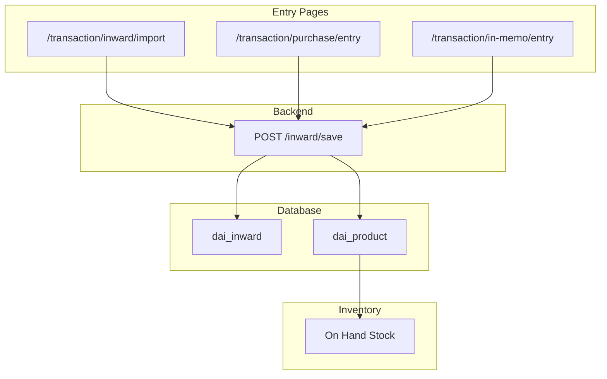
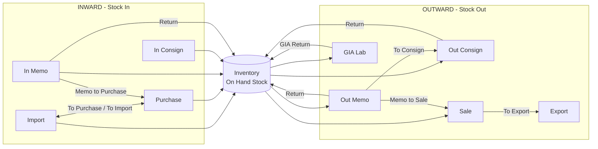

# ShreeHK — Stone Flow Guide

> **Purpose:** Ek jagah par samjho — stone **kahan se add** hota hai, **kahan dikhta** hai, aur **import / purchase / memo / consignment / sale** ke beech **kya convert** ho sakta hai.

---

## 1. Big picture (30-second summary)

```
[ INWARD — stone ERP me aata hai ]
   Import / Purchase / In Memo / In Consignment
              ↓
        dai_inward + dai_product  →  Inventory (On Hand Stock)
              ↓
[ OUTWARD — stone party ko jata hai ]
   Out Memo / Out Consignment / Sale / Export / GIA Lab
              ↓
        dai_outward + product.outward field update
```

| Direction | Main table | Stone field |
|-----------|------------|-------------|
| **Stock IN** | `dai_inward` | `dai_product.inward_id`, `inward` |
| **Stock OUT** | `dai_outward` | `dai_product.outward` = `memo` / `consign` / `sale` / `export` / `lab` |

**Important:** Naya stone **direct inventory table se add nahi** hota. Pehle **Inward transaction** se `dai_product` row banti hai, phir woh inventory me dikhta hai.

---

## 2. Stone add kahan se hota hai?

### 2.1 Primary entry (recommended — naya stock)

| Page | Route | Form | API | Default type |
|------|-------|------|-----|--------------|
| **Inward (Import page)** | `/transaction/inward/import` | `InwardTransactionForm` | `POST /inward/save` | `import` |
| **Purchase Entry** | `/transaction/purchase/entry` | `InwardEntryForm` | `POST /inward/save` | `purchase` |
| **In Memo Entry** | `/transaction/in-memo/entry` | `InwardEntryForm` | `POST /inward/save` | `memo` |

**Inward Type dropdown** (`/transaction/inward/import` par):

| Type | Value | Kya hota hai save par |
|------|-------|------------------------|
| Import | `import` | Category row create + stones inventory me (`site_upload`, `rapnet_upload` = 1) |
| Purchase | `purchase` | Same save flow, `inward_type = purchase` |
| In Memo | `memo` | Party se memo par aaya hua stock inward |
| In Consignment | `consign` | Consignment inward |

**Excel upload:** Sirf `/transaction/inward/import` par (`showExcelUpload`) — Master → Import Format template se line items auto-fill.

**Save ke baad stone kahan jata hai?**
- `dai_inward` — header (entry, invoice, party, date, `inward_type`)
- `dai_product` — har line item (SKU, carat, price, lab, location…)
- `dai_product_value` — attributes (shape, clarity, report no…)
- Inventory list (`/inventory/on-hand` etc.) — yahi products dikhte hain

### 2.2 Secondary — existing stone edit (add nahi)

| Page | Route | Kaam |
|------|-------|------|
| **Stone Update** | `/transaction/stone-update` | SKU search → existing stone ka data edit (`POST /product/save`) |
| **Inventory actions** | `/inventory/...` | Memo, Sale, Consign, Hold, Package — **naya stone nahi**, existing se outward |

---

## 3. Menu map — kaunsi screen kya dikhati hai

### 3.1 Entry forms (naya transaction)

| Menu / Route | Entry ya List? |
|--------------|----------------|
| `/transaction/inward/import` | **Entry** — sab inward types + Excel |
| `/transaction/purchase/entry` | **Entry** — sirf purchase (hidden menu) |
| `/transaction/in-memo/entry` | **Entry** — sirf in memo (hidden menu) |

### 3.2 Stock registers (saved records list)

| Page | Route | DB filter (`inward_type` / `outward type`) | Naya entry button |
|------|-------|---------------------------------------------|---------------------|
| **Purchase Stock** | `/transaction/purchase` | inward: `import`, `purchase`, `consign` | → `/transaction/purchase/entry` |
| **In Memo Stock** | `/transaction/in-memo` | inward: `memo`, `consign` | → `/transaction/in-memo/entry` |
| **Out Memo Stock** | `/transaction/out-memo` | outward: `memo`, `consign` (status on_memo/on_consign) | — |
| **Sale Stock** | `/transaction/sale` | outward: `sale`, `export` (status on_sale/on_export) | — |
| **GIA Lab Stock** | `/transaction/gia-memo` | outward: `lab` (status on_lab) | — |
| **Outward (legacy list)** | `/outward` | All outward list | Inventory se send |

> **Note:** `/transaction/purchase` ka naam "Purchase" hai par list me **Import + Purchase + Consign** teeno inward types dikhte hain.

---

## 4. Inward flows (stone ANDAR aana)



### 4.1 Import vs Purchase (business difference)

| | Import | Purchase |
|--|--------|----------|
| Entry | Inward page → type Import | Inward page → type Purchase **ya** Purchase Entry page |
| Backend extra | `import` par category row insert | Nahi |
| List me dikhega | `/transaction/purchase` (tag: IMPORT) | `/transaction/purchase` (tag: PURCHASE) |
| Toggle | **To Purchase** button | **To Import** button |

**Toggle API:** `POST /transaction/purchase-stock/toggle-type`  
Body: `{ id, inward_type: "purchase" | "import" }`  
Sirf label/history update — naya stone create nahi hota.

### 4.2 In Memo / In Consignment (inward)

- **In Memo** — party ne memo par diya; abhi owned nahi, inward register me track
- **In Consignment** — consignment inward; Purchase Stock list me bhi dikhta hai (`consign` tag)

**In Memo list:** `/transaction/in-memo`  
**Return:** selected stones → `POST /transaction/inward-stock/return` (memo return, stone hide)

**Memo → Purchase:** selected stones → `POST /transaction/inward-stock/memo-to-purchase`  
→ Naya `dai_inward` with `inward_type = purchase` + product price update

---

## 5. Outward flows (stone BAHAR jana)

Stones inventory se **Outward** module se nikalte hain.

### 5.1 Inventory se outward (main daily use)

**Page:** Inventory → On Hand Stock (`DiamondInventoryTable`)  
**API:** `POST /outward/sendTo` (via `sendToOutward`)

| Inventory action | `type` | `dai_outward.status` | Product `outward` |
|------------------|--------|----------------------|-------------------|
| On Memo | `memo` | `on_memo` | `memo` |
| Consignment | `consign` | `on_consign` | `consign` |
| Sale | `sale` | `on_sale` | `sale` |
| Export | `export` | `on_export` | `export` |
| GIA / Lab | `lab` | `on_lab` | `lab` |

**Sale rule (inventory):** Sale sirf **memo** stones par allowed (pehle memo, phir sale).

**Box / Parcel partial:** Agar box se kam pcs/carat memo/sale ho → backend `separateSale` se child SKU split karta hai.

### 5.2 Outward list (legacy)

**Page:** `/outward`  
Saari outward entries — filter, edit, print, delete.

---

## 6. Conversion matrix — kya kya ho sakta hai

### 6.1 Inward side conversions

| From | Action | To | Page | API |
|------|--------|-----|------|-----|
| Import inward | **To Purchase** | Purchase | `/transaction/purchase` | `POST /transaction/purchase-stock/toggle-type` |
| Purchase inward | **To Import** | Import | `/transaction/purchase` | same |
| In Memo inward | **Purchase** (selected stones) | Purchase inward | `/transaction/in-memo` | `POST /transaction/inward-stock/memo-to-purchase` |
| In Memo inward | **Return** | Stone removed from memo | `/transaction/in-memo` | `POST /transaction/inward-stock/return` |

### 6.2 Outward side conversions

| From | Action | To | Page | API |
|------|--------|-----|------|-----|
| Out Memo | **Memo to Sale** (selected) | Sale outward | `/transaction/out-memo` | `POST /transaction/outward-stock/memo-to-sale` |
| Out Memo | **To Consign** | Consignment | `/transaction/out-memo` | `POST /transaction/outward-stock/to-export` (`type: consign`) |
| Out Memo | **Return** | Stone wapas inventory | `/transaction/out-memo` | `POST /transaction/outward-stock/return` |
| Sale | **To Export** | Export | `/transaction/sale` | `POST /transaction/outward-stock/to-export` (`type: export`) |
| GIA Lab | **Return** | Stone wapas stock | `/transaction/gia-memo` | `POST /transaction/gia/return` |

### 6.3 Full lifecycle example

```
1. Add stone     → /transaction/inward/import (type: Import) + Excel
2. Inventory     → On Hand Stock me dikhega
3. Customer ko   → Inventory → On Memo
4. List          → /transaction/out-memo
5. Final sale    → Out Memo → select stones → Memo to Sale
6. List          → /transaction/sale
7. Export bill   → Sale Stock → To Export
```

### 6.4 In Memo → Purchase example

```
1. Party se memo par stone aaya → /transaction/in-memo/entry (type: memo)
2. List → /transaction/in-memo
3. Kharidna hai → select stones → Purchase button
4. Naya purchase inward banega → /transaction/purchase list me dikhega
```

---

## 7. Diagram — poora flow ek saath



---

## 8. List pages — available actions

| Page | Print | Delete | Return | Memo→Sale | Memo→Purchase | To Purchase | To Import | To Consign | To Export |
|------|:-----:|:------:|:------:|:---------:|:-------------:|:-----------:|:---------:|:----------:|:---------:|
| Purchase Stock | ✓ | ✓ | — | — | — | ✓ (import rows) | ✓ (purchase rows) | — | — |
| In Memo Stock | ✓ | ✓ | ✓ | — | ✓ | — | — | — | — |
| Out Memo Stock | ✓ | ✓ | ✓ | ✓ | — | — | — | ✓ | — |
| Sale Stock | ✓ | ✓ | — | — | — | — | — | — | ✓ |
| GIA Lab Stock | ✓ | ✓ | ✓ (modal) | — | — | — | — | — | — |

**Common pattern:** Row expand karo → stones checkbox se select karo → action button dabao.

---

## 9. API quick reference

| Action | Method | Endpoint |
|--------|--------|----------|
| Inward save (add stone) | POST | `/inward/save` |
| Inward check SKU exists | POST | `/inward/checkExist` |
| Purchase stock list | POST | `/transaction/purchase-stock/list` |
| In memo stock list | POST | `/transaction/inward-stock/list` |
| Out memo / sale list | POST | `/transaction/outward-stock/list` |
| GIA list | POST | `/transaction/gia/list` |
| Import ↔ Purchase toggle | POST | `/transaction/purchase-stock/toggle-type` |
| In memo → Purchase | POST | `/transaction/inward-stock/memo-to-purchase` |
| Out memo → Sale | POST | `/transaction/outward-stock/memo-to-sale` |
| Outward to export/consign | POST | `/transaction/outward-stock/to-export` |
| In memo return | POST | `/transaction/inward-stock/return` |
| Out memo return | POST | `/transaction/outward-stock/return` |
| GIA return | POST | `/transaction/gia/return` |
| Inventory → outward | POST | `/outward/sendTo` |
| Stone edit | POST | `/product/save` |
| Invoice print | GET | `/transaction/print/:type/:id` |

---

## 10. Permissions (menu access)

| Permission key | Pages |
|----------------|-------|
| `transaction.inward` | `/transaction/inward/import` |
| `transaction.purchase_stock` | `/transaction/purchase`, `/transaction/purchase/entry` |
| `transaction.in_memo` | `/transaction/in-memo`, `/transaction/in-memo/entry` |
| `transaction.out_memo` | `/transaction/out-memo` |
| `transaction.sale_stock` | `/transaction/sale` |
| `transaction.gia_memo` | `/transaction/gia-memo` |
| `transaction.stone_update` | `/transaction/stone-update` |
| `inventory` | Inventory + memo/sale from stock |
| `outward.main` | `/outward` |

---

## 11. Code locations (developers)

| Area | Frontend | Backend |
|------|----------|---------|
| Inward entry (modern) | `frontEnd/src/pages/transaction/inward/InwardTransactionForm.jsx` | `backend/routes/inward/inwardRoutes.js` |
| Inward entry (legacy) | `frontEnd/src/pages/transaction/stock/InwardEntryForm.jsx` | same `/inward/save` |
| Excel import parser | `frontEnd/src/pages/transaction/inward/inwardExcelImport.js` | — |
| Stock list template | `frontEnd/src/pages/transaction/stock/TransactionStockTemplate.jsx` | `backend/routes/transaction/transactionStockService.js` |
| Inventory outward | `frontEnd/src/pages/inventory/DiamondInventoryTable.jsx` | `backend/routes/outward/outwardService.js` |
| Routes / menu | `frontEnd/src/routes/Routes.jsx` | `backend/index.js` |

---

## 12. Common confusion — short answers

**Q: `/transaction/purchase` par naya stone add hota hai?**  
A: Nahi — yeh **list** hai. Naya add: **New Entry** button → `/transaction/purchase/entry` **ya** `/transaction/inward/import`.

**Q: Import aur Purchase alag module hain?**  
A: Same inward save; sirf `inward_type` alag. Dono `/transaction/purchase` list me dikhte hain.

**Q: Sale direct inventory se ho sakta hai?**  
A: Inventory se **Sale** tabhi jab stone pehle se **memo** par ho (`outward = memo`).

**Q: Out Memo aur Sale alag kyun?**  
A: Memo = temporary (return possible). Sale = final (stock out, `site_upload`/`rapnet_upload` off).

**Q: Stone Update se naya SKU?**  
A: Nahi — existing SKU edit. Naya SKU = Inward entry.

---

*Last updated: June 2026 — ShreeHK FullStack monorepo*
